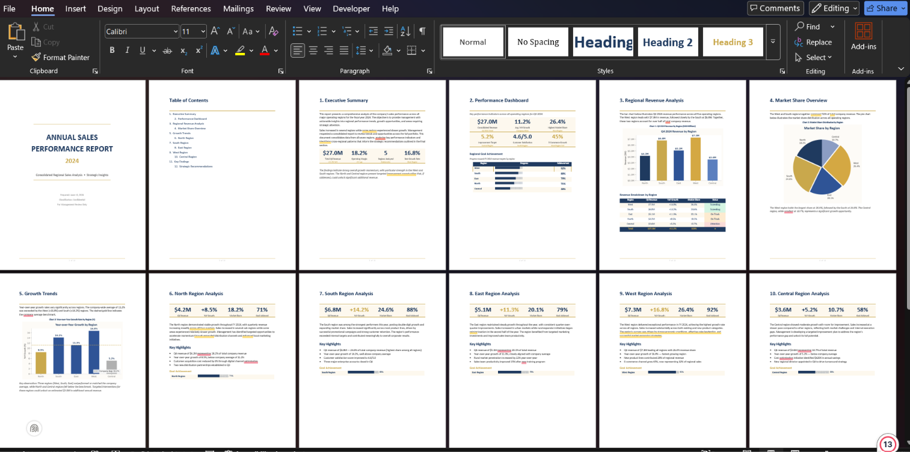

# Task 3 — Business Report Word Formatting

Automated generation and formatting of a professional annual business performance report in Microsoft Word, complete with embedded Excel charts and structured layout.

## Overview

This task takes raw business report content and transforms it into a polished, publication-ready Word document using Python automation. The final report includes dynamic charts, styled tables, a cover page, table of contents, and consistent formatting throughout.

## Files

| File | Description |
|------|-------------|
| `Raw_Word_Formatting_Task.docx` | Unformatted raw source document to be processed. |
| `Professional_Business_Report_2024.docx` | Final formatted report — version 1. |
| `Professional_Business_Report_2024_v2.docx` | Final formatted report — version 2 (refined). |
| `build_final.py` | Python script (`win32com`) that builds the report programmatically. |
| `business_word_report.png` | Screenshot preview of the final output. |

## Preview

## Features

- **Cover Page** — Professional title page with report name, year, date, and classification
- **Table of Contents** — Auto-generated with all 12 sections listed
- **Executive Summary** — High-level overview of company performance
- **Performance Dashboard** — KPI summary cards + regional goal progress bars
- **Regional Revenue Analysis** — Column chart + full revenue breakdown table
- **Market Share Overview** — Pie chart + commentary on distribution
- **Growth Trends** — Bar chart with company-average benchmark line
- **Regional Deep-Dives** — Individual analysis pages for all 5 regions (North, South, East, West, Central) with bullet highlights and goal bars
- **Key Findings** — 4 major takeaways with supporting data
- **Strategic Recommendations** — 5 actionable items for FY 2025
- **Page Footers** — Automatic page numbering ("Page X of Y")

## Automation Details

The `build_final.py` script uses `win32com.client` to control Microsoft Word and Excel directly via COM automation:

- **OLE-Embedded Charts** — Charts are inserted as live Excel OLE objects; double-click to edit the underlying data in Excel
- **Programmatic Styling** — Consistent fonts (Calibri), colors (navy/gold/white theme), spacing, and alignment
- **Conditional Formatting** — Status indicators (Exceeding / On Track / Attention) with color-coded table cells
- **Goal Progress Bars** — Visual Unicode-block bars showing regional achievement percentages

## Output

The final document is a **12-section, 15+ page** professional report suitable for management review and board presentations.

## Requirements

- Windows OS with Microsoft Word and Excel installed
- Python with `pywin32` (`pip install pywin32`)
