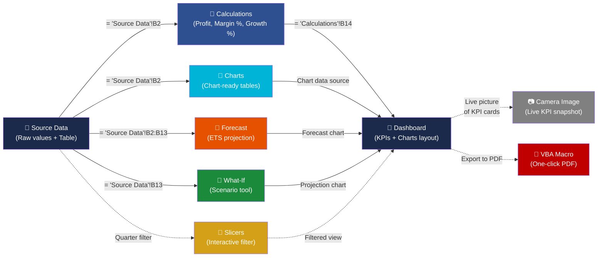

# Sales Performance Dashboard — Excel Project

## Project Overview

This is an **intermediate-level Excel / data entry project** that transforms a flat monthly sales dataset into a **professional executive-ready business dashboard**. The workbook demonstrates core Excel skills: data structuring, formula-based calculations, conditional formatting, charting, and dashboard layout design.

The final deliverable is a single `.xlsm` file (`Sales_Dashboard.xlsm`) containing **7 interconnected sheets + a Camera tool image + a VBA PDF export button** that automatically update when the source data changes.

---

## Dashboard Gallery

  <table style="border-collapse: collapse; width: 100%; max-width: 900px;">
    <tr>
      <td style="padding: 10px; text-align: center; vertical-align: top; border: 1px solid #ddd; border-radius: 8px;">
        
        <strong style="display: block; margin-top: 8px; font-size: 14px;">📊 Executive Dashboard</strong>
        KPI cards, sparklines &amp; revenue charts
      </td>
      <td style="padding: 10px; text-align: center; vertical-align: top; border: 1px solid #ddd; border-radius: 8px;">
        
        <strong style="display: block; margin-top: 8px; font-size: 14px;">📈 Chart Engine</strong>
        Chart-ready data tables feeding the dashboard
      </td>
      <td style="padding: 10px; text-align: center; vertical-align: top; border: 1px solid #ddd; border-radius: 8px;">
        
        <strong style="display: block; margin-top: 8px; font-size: 14px;">🔢 Calculations</strong>
        Profit, margin &amp; growth formulas with conditional formatting
      </td>
    </tr>
    <tr>
      <td style="padding: 10px; text-align: center; vertical-align: top; border: 1px solid #ddd; border-radius: 8px;">
        
        <strong style="display: block; margin-top: 8px; font-size: 14px;">🔮 Revenue Forecast</strong>
        FORECAST.ETS with 90% confidence bands
      </td>
      <td style="padding: 10px; text-align: center; vertical-align: top; border: 1px solid #ddd; border-radius: 8px;">
        
        <strong style="display: block; margin-top: 8px; font-size: 14px;">📅 Quarterly Filter</strong>
        Interactive slicer by quarter (Q1–Q4)
      </td>
      <td style="padding: 10px; text-align: center; vertical-align: top; border: 1px solid #ddd; border-radius: 8px;">
        
        <strong style="display: block; margin-top: 8px; font-size: 14px;">🎯 What-If Analysis</strong>
        Scenario modelling with compounding growth
      </td>
    </tr>
  </table>

---

## Dataset

The source data consists of 12 months (January–December) of sales figures:

| Column    | Description                        |
|-----------|------------------------------------|
| Month     | Calendar month (Jan–Dec)           |
| Revenue   | Monthly revenue in dollars         |
| Expenses  | Monthly operating expenses         |
| Leads     | Number of new leads generated      |
| Orders    | Number of orders closed            |
| Month Num | Numeric month (1–12, formula-driven) |
| Quarter   | Fiscal quarter (Q1–Q4, formula-driven) |

---

- **Dynamic title** — The dashboard header includes a formula-driven title (e.g., "YTD Performance — 85.3% Profit Margin") that updates automatically as source data changes.

## Workbook Structure

The workbook is divided into **7 sheets + a Camera tool image + a VBA macro**, each serving a distinct purpose. Below is a dependency diagram showing how data flows between them:

**Data flow summary**: `Source Data` → `Calculations` & `Charts` & `Forecast` & `What-If` (via direct cell references) → `Dashboard` (via formula references and chart bindings). The `Slicers` sheet provides interactive filtering over the `Source Data` Table.

### 1. Source Data

- Contains the **original raw data**, exactly as provided — never modified.
- Formatted with dark navy headers, centered alignment, and comma-separated number formatting.
- This is the **single source of truth**; every other sheet references this sheet.
- Two additional formula-driven columns have been added:
  - **Month Num** — `=MATCH(A2,{"Jan","Feb",...},0)` converts text months to numbers 1–12
  - **Quarter** — `="Q"&ROUNDUP(MATCH(...)/3,0)` groups months into Q1–Q4
- The data range has been converted to an **Excel Table** named `SalesData`, which enables structured references and slicer support. New rows added to the table are automatically picked up by all dependent features.

### 2. Calculations

- All cells are **formula-driven** and reference `Source Data`.
- Calculates the following derived metrics:
  - **Profit** — Revenue minus Expenses
  - **Profit Margin %** — Profit divided by Revenue
  - **Monthly Growth %** — Month-over-month revenue growth rate
- Includes a **Totals row** (SUM of each column).
- **Data bars and icon sets** applied to Profit Margin % and Growth % columns for instant visual scanning (gradient bars + directional arrows).
- Conditional formatting highlights strong (>50%) and weak (<20%) profit margins, as well as positive/negative growth.

### 3. Charts

- Contains two clean **data tables** that serve as the source ranges for the dashboard charts:
  - **Revenue Trend** (Month + Revenue)
  - **Revenue vs Expenses** (Month + Revenue + Expenses)
- All cells are formulas linked to `Source Data`, ensuring charts update automatically.

### 4. Forecast

A forward-looking sheet that projects the next quarter's revenue using Excel's **exponential triple smoothing** algorithm.

#### Structure

| Column | Description |
|--------|-------------|
| **Period** | Numeric timeline (1–15) — 1–12 historical, 13–15 forecast |
| **Month** | Month label (Jan–Dec for historical, Jan/Feb/Mar (Forecast) for projected) |
| **Revenue (Actual)** | Cross-sheet reference to `Source Data!B2:B13` |
| **Forecast Revenue** | `FORECAST.ETS` result — identical to actual for historical periods, projected for Periods 13–15 |
| **Confidence Interval (±)** | `FORECAST.ETS.CONFINT` at 90% confidence — the margin of error for each forecast point |
| **Lower Bound** | Forecast minus the confidence interval |
| **Upper Bound** | Forecast plus the confidence interval |

#### Key Formulas

| Formula | Location | Purpose |
|---------|----------|---------|
| `=FORECAST.ETS(A20, $C$5:$C$16, $A$5:$A$16, 1, 1, 1)` | Forecast column (Periods 13–15) | Projects revenue using exponential triple smoothing with auto-detected seasonality (12-month cycle) |
| `=FORECAST.ETS.CONFINT(A20, $C$5:$C$16, $A$5:$A$16, 0.9, 1)` | CI column (Periods 13–15) | Returns the half-width of the 90% prediction interval |

**Parameters explained:**
- **Seasonality = 1** — Auto-detect (finds 12-month seasonal pattern)
- **Data completion = 1** — Auto-fill missing points (none missing here)
- **Aggregation = 1** — Average (default for multiple values per period)
- **Confidence level = 0.9** — 90% confidence interval

#### Chart
A **line chart** titled *"Revenue Forecast with 90% Confidence Interval"* visualises:
- **Actual Revenue** — Solid navy line (Periods 1–12)
- **Forecast Revenue** — Dashed orange line (Periods 1–15, overlapping actual for 1–12)
- **Upper / Lower Bounds** — Dotted gray lines showing the confidence cone widening as the forecast extends further

#### Summary Statistics
Below the data table, key aggregates are calculated automatically:
- Total Historical Revenue
- Average Monthly Revenue
- Projected Q1 Revenue (total of the 3 forecast months)
- Projected Q1 Lower / Upper Bounds

### 5. What-If

An interactive scenario modelling tool that projects revenue for the next 12 months based on a user-defined monthly growth rate.

#### Structure

| Area | Description |
|------|-------------|
| **Input cell (B5)** | User enters a projected monthly growth rate (default: 5%) |
| **Preset dropdown (B6)** | Quick-select from 3%, 5%, 8%, or 10% (copy to B5) |
| **Projection table** | 12-month compounding forecast starting from December's actual revenue |
| **Key result** | Projected Year-End Revenue displayed prominently |
| **Chart** | Clustered column chart comparing baseline vs projected revenue per month |
| **Scenario Comparison** | Reference table listing all preset scenarios |

#### How the Projection Works

| Column | Formula (Month 1) | Formula (Month 2+) |
|--------|------------------|-------------------|
| **Starting Revenue** | `='Source Data'!B13` (Dec actual) | `=C{prev}` — previous month's projected |
| **Projected Revenue** | `=B{row}*(1+$B$5)` | Same, compounding month over month |
| **Growth Amount** | `=C{row}-B{row}` | Same pattern |

The growth **compounds** each month: Month 2's starting revenue is Month 1's projected revenue, Month 3's starting revenue is Month 2's projected, and so on — creating a realistic compounding projection.

#### Key Formulas

| Formula | Location | Purpose |
|---------|----------|---------|
| `=IF($B$5<>"",B12*(1+$B$5),"")` | Projected Revenue (all months) | Applies the input growth rate |
| `=IF($B$5<>"",C12,"")` | Starting Revenue (months 2–12) | Chains previous projected forward |
| `=SUM(C12:C23)` | Totals row | Aggregates projected year-end revenue |
| `=IF(C12="","",C12-B12)` | Growth Amount | Shows incremental gain each month |

#### Chart
A **clustered column chart** compares:
- **Starting Revenue** (light blue) — baseline figure each month
- **Projected Revenue** (teal) — revenue after applying the growth rate

Data labels on the projected series show exact values.

### 6. Slicers

An interactive filtering system that lets you filter all data by quarter (Q1–Q4) with a single click. Slicers are a hallmark of professional Excel dashboards.

#### How It Works

The Source Data sheet has been enhanced with two formula-driven columns and converted to an **Excel Table** (`SalesData`). Excel Tables support slicers natively — a slicer is a visual filter control with clickable buttons for each unique value in a column.

#### What's Prepared

| Item | Details |
|------|---------|
| **Quarter column** | Formula groups each month into Q1/Q2/Q3/Q4 |
| **SalesData Table** | `Source Data!A1:G13` is now a named Excel Table |
| **Slicers sheet** | Step-by-step instructions for the 30-second setup |

#### Manual Setup (30 seconds)

Excel's slicer creation cannot be fully automated via openpyxl, but the setup is minimal:

1. **Create a PivotTable** — Select any cell in `SalesData` → Insert → PivotTable → New Worksheet → drag *Quarter* to Rows and *Revenue* to Values
2. **Insert the Slicer** — Click the PivotTable → PivotTable Analyze → Insert Slicer → check **Quarter** → OK
3. **Use it** — Click Q1 to see Q1 data, Ctrl+click for multiple quarters, click the clear button to reset

Once created, the slicer can be:
- Positioned and resized anywhere
- Connected to multiple PivotTables and charts
- Formatted with the dashboard's colour theme

#### Key Formulas

| Formula | Location | Purpose |
|---------|----------|---------|
| `="Q"&ROUNDUP(MATCH(A2,{months},0)/3,0)` | Source Data!G2:G13 | Derives quarter from month name |
| `=MATCH(A2,{months},0)` | Source Data!F2:F13 | Converts month name to number 1–12 |

### 7. Camera Tool

A **live picture** of the KPI cards captured via Excel's Camera tool and placed directly on the Dashboard sheet for a polished, presentation-ready look.

#### What It Does

The Camera tool takes a live "photograph" of any selected range. The resulting image reflects real-time data — when source numbers change, the picture updates automatically. Unlike regular copy-paste, the image can be resized, rotated, and styled without affecting the underlying cell layout.

#### Setup (10 seconds, manual)

Since the Camera tool is an Excel UI feature, it requires one-time manual setup:

1. **Add Camera to Quick Access Toolbar** — File → Options → Quick Access Toolbar → All Commands → Camera → Add → OK
2. **Select the KPI card range** on the Dashboard (e.g., `B3:K5`)
3. **Click the Camera icon** in the top toolbar
4. **Click anywhere** on the Dashboard to paste the live image

#### Formatting Tips
- Right-click the picture → **Format Picture** → **Fill** → **No Fill** for a transparent background
- **Line** → **No Line** to remove the border
- Drag corners to resize proportionally
- Position the image below the highlight metrics or beside the charts for a compact executive layout

The camera image is purely visual — it adds zero overhead to the workbook and updates automatically with all other dashboard elements.

### 8. VBA — One-Click PDF Export

A macro button on the Dashboard that exports the sheet to PDF with a single click.

#### Setup

1. **Save as macro-enabled** — File → Save As → Type: `Excel Macro-Enabled Workbook (*.xlsm)`
2. **Open VBA editor** — Alt+F11
3. **Insert a Module** — Right-click VBAProject → Insert → Module
4. **Import the code** — Open `ExportDashboardToPDF.bas` (in the same folder) and copy its contents into the module
5. **Add a button** — Developer tab → Insert → Button (Form Control) → assign `ExportDashboardToPDF`
6. **Save** — Ctrl+S (confirm macro-enabled)

#### Security Note
Excel blocks macros by default. When opening the file, click **Enable Content** on the yellow security bar. The macro is safe — it only exports the Dashboard sheet.

#### Output
The PDF is saved alongside the Excel file as `Dashboard_Export_2026-06-15.pdf` and opens automatically after export.

### 9. Dashboard

The main visual output — designed as an **executive report layout** with:

#### KPI Cards
Five key performance indicator cards displayed in a single row:

| KPI             | Source Formula                    |
|-----------------|-----------------------------------|
| Total Revenue   | `='Calculations'!B14`            |
| Total Expenses  | `='Calculations'!C14`            |
| Total Profit    | `='Calculations'!D14`            |
| Total Leads     | `='Calculations'!E14`            |
| Total Orders    | `='Calculations'!F14`            |

Each card features a color-coded value, a label, a "Year to Date" subtitle, and an inline **sparkline** showing the monthly trend across all 12 months — giving instant directionality (↑↓) without taking extra space. Cards are enclosed in a bordered card design.

#### Highlight Metrics
Two additional metrics displayed below the KPI row:
- **Profit Margin** (overall YTD)
- **Avg Monthly Growth** (average of all monthly growth rates)

#### Charts
Four embedded charts (plus a standalone forecast chart on the Forecast sheet and slicer-powered filtering on the Slicers sheet):
- **Revenue Trend** — Line chart showing revenue trajectory across the year
- **Revenue vs Expenses** — Clustered column chart comparing revenue and expenses side-by-side
- **Combo Chart** — Revenue as columns with Profit Margin % as an overlaid line on a secondary axis, showing the relationship between top-line growth and profitability
- **Waterfall Chart** — A P&L breakdown walking from Revenue → Expenses → Net Profit, the gold standard for profit storytelling

All charts include data labels and are styled with the dashboard's color theme.

---

## Formulas & Excel Concepts Used

### Cell References
- Direct cross-sheet references: `='Source Data'!B2`
- Relative references for per-row calculations

### Mathematical Formulas
| Formula | Purpose |
|---|---|
| `=B2-C2` | Profit calculation |
| `=IF(B2=0,"",D2/B2)` | Profit Margin % with zero-division guard |
| `=IF(B2=0,"",(B3-B2)/B2)` | Month-over-month growth with guard |
| `=SUM(B2:B13)` | Aggregated totals |
| `=AVERAGE(H2:H13)` | Average growth rate |
| `=FORECAST.ETS(A20, $C$5:$C$16, $A$5:$A$16, 1, 1, 1)` | Revenue forecast (next 3 months) |
| `=FORECAST.ETS.CONFINT(A20, $C$5:$C$16, $A$5:$A$16, 0.9, 1)` | 90% confidence interval for forecast |
| `=IF($B$5<>"",B12*(1+$B$5),"")` | What-If: projected revenue with compounding growth |
| `=IF($B$5<>"",C12,"")` | What-If: chains projected values forward month to month |
| `=SUM(C12:C23)` | What-If: projected year-end revenue total |
| `="Q"&ROUNDUP(MATCH(A2,{months},0)/3,0)` | Source Data: derives quarter from month name |
| `=MATCH(A2,{months},0)` | Source Data: converts month name to number 1–12 |

### Number Formatting
| Format | Usage |
|---|---|
| `#,##0` | Revenue, Expenses, Profit, Leads, Orders |
| `0.0%` | Profit Margin %, Growth % |

### Conditional Formatting & Visual Enhancements
- **Data bars** — Gradient bars on Profit Margin % and Growth % columns for proportional visual comparison
- **Icon sets** — Directional arrows (green up, yellow sideways, red down) on Growth % for instant trend reading
- Green fill (value > 0.5 / > 0) — strong profit margins / positive growth
- Red fill (value < 0.2 / < 0) — weak profit margins / negative growth

### Charts
- **Line Chart** — Revenue trend over time
- **Line Chart (Forecast)** — Actual + projected revenue with 90% CI bounds
- **Clustered Column Chart** — Revenue vs Expenses comparison
- **Clustered Column Chart (What-If)** — Baseline vs projected revenue comparison
- **Combo Chart** — Revenue columns + Profit Margin % line on secondary axis
- **Waterfall Chart** — P&L walkdown (Revenue → Expenses → Profit)

### Dashboard Layout Techniques
- Merged cells for titles and multi-column card values
- Consistent column widths for aligned KPI cards
- Color-coded values (teal, red, green, blue, orange) for visual quick-scanning
- Borders, padding, and spacing for a clean business aesthetic
- Formula-driven dynamic title in the dashboard header
- Inline sparklines inside each KPI card for monthly trend context
- Data validation dropdowns for interactive scenario selection
- Excel Table (`SalesData`) for structured references and slicer compatibility
- Camera tool live picture for a polished, resizable KPI snapshot

---

## How to Use

1. Open `Sales_Dashboard.xlsx` in Microsoft Excel (or any spreadsheet application that supports formulas and charts).
2. Navigate to the **Source Data** sheet and modify any value (e.g., change a revenue figure).
3. Switch to the **Calculations**, **Charts**, **Forecast**, **What-If**, **Slicers**, or **Dashboard** sheets — all values and charts will have updated automatically.
4. Click the **Export to PDF** button on the Dashboard to generate a PDF snapshot (macro-enabled `.xlsm` required).

---

## Design Principles

- **Single source of truth** — All data originates from `Source Data` and is referenced via formulas.
- **Separation of concerns** — Raw data, calculations, chart data, and the visual dashboard each live in their own sheet.
- **Dynamic updates** — Every number and chart is formula-driven; there are no hardcoded values.
- **Professional styling** — Dark navy/teal color palette, clean card layout, appropriate font hierarchy.
- **Error handling** — `IF` guards prevent division-by-zero errors in percentage calculations.
- **Interactive filtering** — Excel Table + slicer support enables one-click quarter-based filtering across the dashboard.
- **Forward-looking analysis** — `FORECAST.ETS` with confidence intervals projects future revenue, turning the dashboard from a historical report into a planning tool.

---

## Tools Used

- **Python 3** with `openpyxl` library — used to programmatically build the workbook
- **Microsoft Excel** — target application (file is standard `.xlsm` format, macro-enabled)
- **VBA** — one-click PDF export macro on the Dashboard sheet

---

## Project Context

This project was completed as part of a **data entry portfolio** — specifically "Task 5 — Sales Dashboard" — demonstrating the ability to take raw tabular data and produce a polished, client-ready business intelligence deliverable entirely within Excel.
