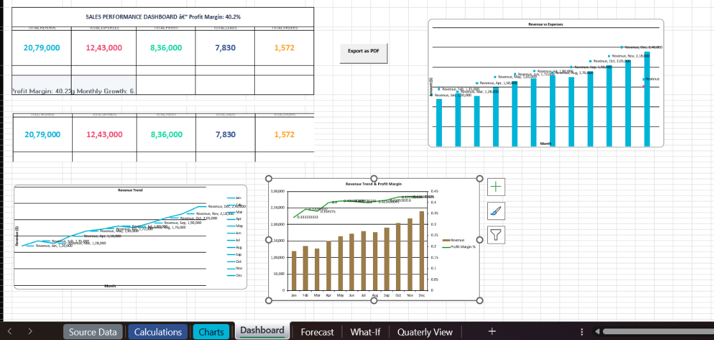
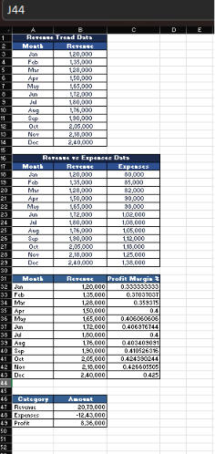
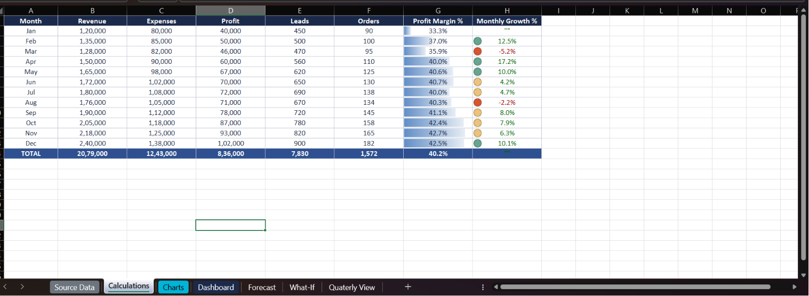
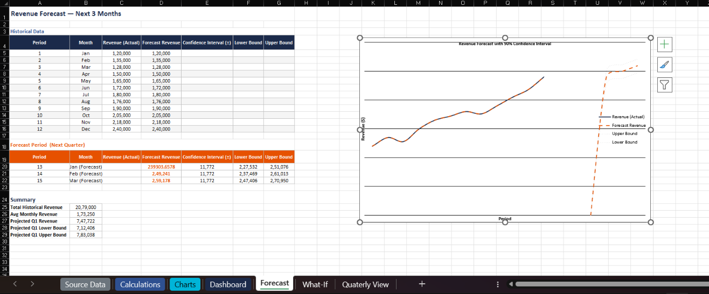
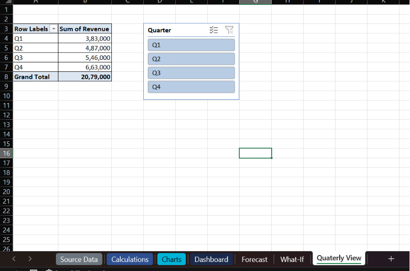
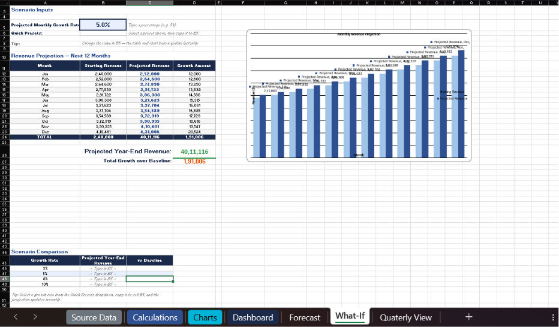

# Task 4 — Sales Dashboard

Interactive Excel sales dashboard with KPI cards, dynamic charts, forecasting, what-if analysis, and one-click PDF export.

---

## Dashboard Gallery

  <table style="border-collapse: collapse; width: 100%; max-width: 900px;">
    <tr>
      <td style="padding: 10px; text-align: center; vertical-align: top; border: 1px solid #ddd; border-radius: 8px;">
        
        <strong style="display: block; margin-top: 8px; font-size: 14px;">📊 Executive Dashboard</strong>
        KPI cards, sparklines &amp; revenue charts
      </td>
      <td style="padding: 10px; text-align: center; vertical-align: top; border: 1px solid #ddd; border-radius: 8px;">
        
        <strong style="display: block; margin-top: 8px; font-size: 14px;">📈 Chart Engine</strong>
        Chart-ready data tables feeding the dashboard
      </td>
      <td style="padding: 10px; text-align: center; vertical-align: top; border: 1px solid #ddd; border-radius: 8px;">
        
        <strong style="display: block; margin-top: 8px; font-size: 14px;">🔢 Calculations</strong>
        Profit, margin &amp; growth formulas with conditional formatting
      </td>
    </tr>
    <tr>
      <td style="padding: 10px; text-align: center; vertical-align: top; border: 1px solid #ddd; border-radius: 8px;">
        
        <strong style="display: block; margin-top: 8px; font-size: 14px;">🔮 Revenue Forecast</strong>
        FORECAST.ETS with 90% confidence bands
      </td>
      <td style="padding: 10px; text-align: center; vertical-align: top; border: 1px solid #ddd; border-radius: 8px;">
        
        <strong style="display: block; margin-top: 8px; font-size: 14px;">📅 Quarterly Filter</strong>
        Interactive slicer by quarter (Q1–Q4)
      </td>
      <td style="padding: 10px; text-align: center; vertical-align: top; border: 1px solid #ddd; border-radius: 8px;">
        
        <strong style="display: block; margin-top: 8px; font-size: 14px;">🎯 What-If Analysis</strong>
        Scenario modelling with compounding growth
      </td>
    </tr>
  </table>

---

## Overview

An intermediate-level Excel project that transforms flat monthly sales data into a professional executive-ready dashboard. The workbook demonstrates core Excel skills: data structuring, formula-based calculations, conditional formatting, charting, and dashboard layout design.

The final deliverable is `Sales_Dashboard.xlsm` containing **7 interconnected sheets + a Camera tool image + a VBA PDF export button** that automatically update when source data changes.

---

## Dataset

| Column | Description |
|--------|-------------|
| Month | Calendar month (Jan–Dec) |
| Revenue | Monthly revenue in dollars |
| Expenses | Monthly operating expenses |
| Leads | Number of new leads generated |
| Orders | Number of orders closed |
| Month Num | Numeric month (1–12, formula-driven) |
| Quarter | Fiscal quarter (Q1–Q4, formula-driven) |

---

## Workbook Structure

### 1. Source Data
Raw data — never modified. Formatted as an Excel Table (`SalesData`) with two formula-driven columns (Month Num, Quarter) enabling structured references and slicer support.

### 2. Calculations
Formula-driven derived metrics: **Profit**, **Profit Margin %**, **Monthly Growth %**. Data bars, icon sets, and conditional formatting for instant visual scanning.

### 3. Charts
Clean data tables serving as source ranges for dashboard charts — Revenue Trend and Revenue vs Expenses. All cells are formulas linked to Source Data.

### 4. Forecast
Forward-looking sheet projecting the next quarter's revenue using `FORECAST.ETS` exponential triple smoothing with a **90% confidence interval**. Includes a line chart with upper/lower bound shading.

### 5. What-If
Interactive scenario modelling tool. User inputs a monthly growth rate (or selects a preset: 3%, 5%, 8%, 10%) and sees a **12-month compounding projection** with a clustered column chart comparing baseline vs projected revenue.

### 6. Slicers
Interactive quarter-based filtering using Excel Slicers connected to the `SalesData` table — one-click Q1/Q2/Q3/Q4 filtering across the dashboard.

### 7. Camera Tool
Live picture of the KPI cards captured via Excel's Camera tool — a resizable, auto-updating image placed on the Dashboard for a polished executive layout.

### 8. VBA — One-Click PDF Export
Macro button exporting the Dashboard sheet to PDF. Source code in `ExportDashboardToPDF.bas`. Saves as `Dashboard_Export_YYYY-MM-DD.pdf`.

### 9. Dashboard
The main visual output — executive report layout with:
- **5 KPI cards** (Revenue, Expenses, Profit, Leads, Orders) with inline sparklines
- **Highlight metrics** (Profit Margin, Avg Monthly Growth)
- **4 charts** — Revenue Trend (line), Revenue vs Expenses (clustered column), Combo Chart (column + line on secondary axis), Waterfall Chart (P&L walkdown)

---

## Files

| File | Description |
|------|-------------|
| `Sales_Dashboard.xlsm` | Macro-enabled workbook with all sheets, charts, and VBA |
| `Sales_Dashboard.xlsx` | Macro-free version of the workbook |
| `Sales_Dashboard_Source_Data.xlsx` | Original raw dataset |
| `Dashboard_Export_2026-06-15.pdf` | Sample PDF export |
| `ExportDashboardToPDF.bas` | VBA source code for PDF export button |
| `dashboard.png` | Screenshot — main dashboard view |
| `charts.png` | Screenshot — chart engine sheet |
| `calculations.png` | Screenshot — calculations sheet |
| `forecast.png` | Screenshot — forecast sheet |
| `quaterly-view.png` | Screenshot — quarterly slicer view |
| `what-if-analysis.png` | Screenshot — what-if analysis sheet |

---

## Key Formulas

| Formula | Purpose |
|---------|---------|
| `=B2-C2` | Profit |
| `=IF(B2=0,"",D2/B2)` | Profit Margin % |
| `=FORECAST.ETS(period, values, timeline, 1, 1, 1)` | Revenue forecast |
| `=FORECAST.ETS.CONFINT(period, values, timeline, 0.9, 1)` | 90% confidence interval |
| `=IF(B5<>"", prev*(1+B5), "")` | What-If compounding projection |
| `="Q"&ROUNDUP(MATCH(A2,{months},0)/3,0)` | Derive quarter from month |
| `=MATCH(A2,{months},0)` | Convert month name to number |

---

## Design Principles

- **Single source of truth** — All data originates from `Source Data`
- **Separation of concerns** — Each layer has its own sheet
- **Dynamic updates** — Every number and chart is formula-driven
- **Professional styling** — Dark navy/teal palette, clean card layout
- **Error handling** — IF guards prevent division-by-zero errors
- **Interactive filtering** — Excel Table + slicers for one-click quarter filtering

---

## Requirements

- Microsoft Excel 2016+ (or Excel 365) — some features require modern Excel (`FORECAST.ETS`, Waterfall Chart)
- Macros must be enabled for the PDF export button
