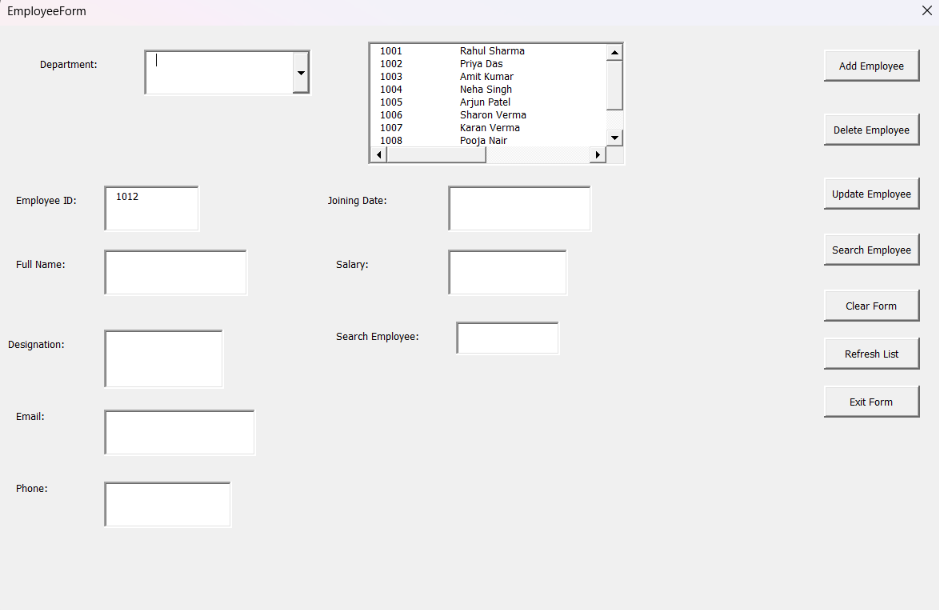
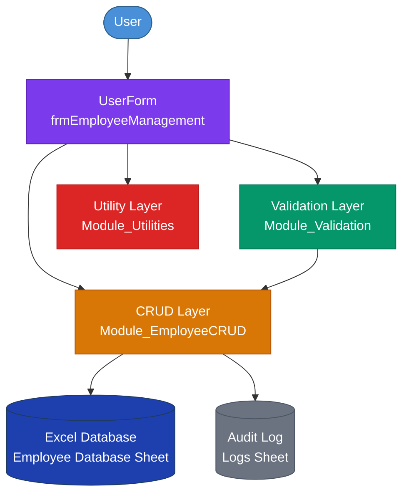
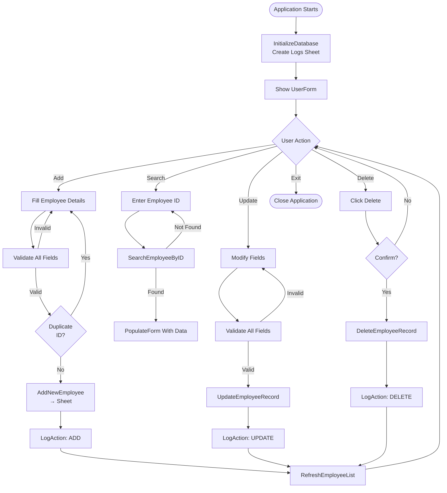
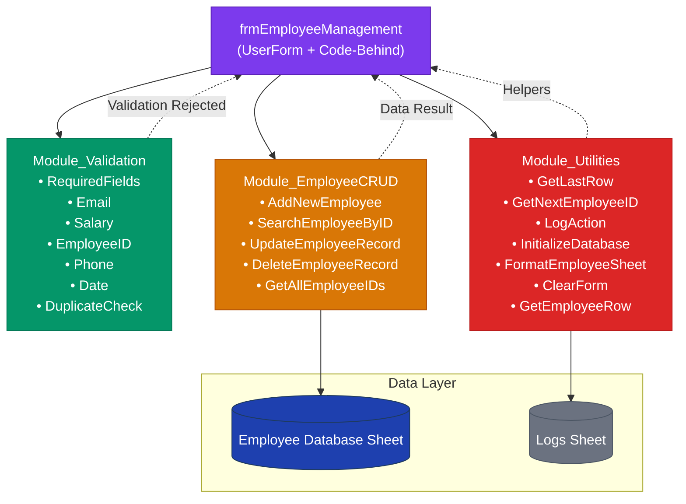

# Employee Management System

A professional **Excel VBA Employee Management System** built with UserForms, modular VBA architecture, and a structured Excel database backend. Designed as a portfolio-quality project suitable for freelancers, consultants, and small-to-medium businesses.

---

## Project Overview

The **Employee Management System** is a complete Excel-based application that allows users to manage employee records through a professional graphical interface without directly editing spreadsheet rows. It provides full CRUD (Create, Read, Update, Delete) capabilities with built-in validation, logging, and error handling.

**Use Cases:**
- Small business HR departments
- Freelancers managing team records
- Educational projects demonstrating VBA capabilities
- Portfolio showcase for Excel/VBA development

---

## Features

| Feature | Description |
|---------|-------------|
| **Add Employee** | Add new employees with validated fields; prevents duplicate IDs |
| **Search Employee** | Search by Employee ID; auto-populates form fields |
| **Update Employee** | Modify existing employee records with full validation |
| **Delete Employee** | Remove records with confirmation dialog |
| **Clear Form** | Reset all input fields to default state |
| **Employee List** | View all employees in a searchable list view |
| **Validation** | Email format, numeric salary, Employee ID, and required field checks |
| **Audit Logging** | All actions are timestamped and logged to a dedicated Logs sheet |
| **Auto-ID Generation** | Next Employee ID is suggested automatically |
| **Professional UI** | Segoe UI fonts, organized layout, clear labeling |

---

## Technology Stack

| Technology | Purpose |
|------------|---------|
| Microsoft Excel | Application platform |
| VBA (Visual Basic for Applications) | Programming language |
| VBA UserForms | Graphical user interface |
| Excel Worksheet | Database backend |

---

## Project Structure

```
├── Employee_Management_VBA_Task.xlsx
│   ├── Employee Database      # Sheet 1: Employee records
│   ├── Instructions           # Sheet 2: Usage instructions
│   └── Logs                   # Sheet 3: Audit trail (auto-created)
│
├── Employee_Management_VBA_Task.xlsm   # Macro-enabled workbook
│
├── vba-code/
│   ├── Module_Validation.bas           # Validation functions
│   ├── Module_Utilities.bas            # Utility functions
│   ├── Module_EmployeeCRUD.bas         # CRUD operations
│   ├── frmEmployeeManagement.frm       # UserForm definition + code
│   └── frmEmployeeManagement_Code.bas  # UserForm code-behind
│
├── screenshots/                        # Application screenshots
└── README.md                           # This file
```

---

## User Interface Overview



The UserForm is divided into three main sections:

### Header
- Application title: **EMPLOYEE MANAGEMENT SYSTEM**
- Subtitle with contextual guidance

### Employee Details (Left Panel)
| Field | Type | Required |
|-------|------|----------|
| Employee ID | Numeric TextBox | Yes |
| Full Name | TextBox | Yes |
| Department | Drop-down ComboBox | Yes |
| Designation | TextBox | No |
| Email | TextBox | Yes |
| Phone | TextBox (10+ digits) | No |
| Joining Date | Date TextBox | No |
| Salary | Numeric TextBox | No |

### Search & List (Right Panel)
- **Search field** with Search button
- **Employee list** showing ID, Name, Department, Designation
- Click any row to populate the form

### Button Bar (Bottom)
| Button | Action |
|--------|--------|
| Add Employee | Validates and adds new record |
| Update Employee | Updates selected record |
| Delete Employee | Removes record with confirmation |
| Clear Form | Resets all inputs |
| Refresh List | Reloads employee list |
| Exit | Closes the application |

---

## Setup Instructions

### Prerequisites
- Microsoft Excel 2016 or later (Windows)
- Macros enabled

### Files Required
- `Employee_Management_VBA_Task.xlsm` (macro-enabled workbook)

### Build from Source (Manual)
1. Open `Employee_Management_VBA_Task.xlsx` (template)
2. Press `Alt + F11` to open the VBA Editor
3. Go to **File > Import File** and import each `.bas` file:
   - `Module_Validation.bas`
   - `Module_Utilities.bas`
   - `Module_EmployeeCRUD.bas`
4. Insert a **UserForm**, name it `frmEmployeeManagement`, copy the code from `frmEmployeeManagement_Code.bas` into its code window
5. Add the `Workbook_Open` code to `ThisWorkbook`:
   ```vba
   Private Sub Workbook_Open()
       Module_Utilities.InitializeDatabase
       frmEmployeeManagement.Show
   End Sub
   ```
6. Save as **Macro-Enabled Workbook (*.xlsm)**

---

## How To Use the Application

### Adding an Employee
1. The form opens with the next available Employee ID
2. Fill in the required fields (marked with *)
3. Click **Add Employee**
4. A success message confirms the addition

### Searching for an Employee
1. Enter an Employee ID in the **Search** field
2. Click **Search** — the record populates the form
3. Alternatively, click any row in the employee list

### Updating an Employee
1. Search for the employee or click the list
2. Modify the desired fields
3. Click **Update Employee**
4. Confirm the update

### Deleting an Employee
1. Search for the employee
2. Click **Delete Employee**
3. Click **Yes** on the confirmation dialog
4. The record is permanently removed

### Viewing the Audit Log
- Check the **Logs** sheet (Sheet 3)
- Timestamps, actions, and affected Employee IDs are recorded

---

## Validation Rules

| Field | Rule | Error Message |
|-------|------|---------------|
| Employee ID | Required, numeric, positive, <= 10 digits, unique | "Employee ID is a required field." / "Employee ID already exists." |
| Full Name | Required, non-empty | "Full Name is a required field." |
| Department | Required, selected from dropdown | "Department is a required field." |
| Email | Required, must contain `@` and domain with `.` | "Email must contain '@' with characters before it." |
| Phone | Optional, >= 10 digits, <= 15 digits | "Phone number must contain at least 10 digits." |
| Salary | Optional, numeric, positive | "Salary must be a positive number." |
| Joining Date | Optional, must be a valid date | "Please enter a valid date." |

---

## VBA Architecture

### System Architecture Diagram



### Employee Management Workflow



### VBA Module Structure



### Code Organization

| Module | File | Purpose |
|--------|------|---------|
| `Module_Validation` | `Module_Validation.bas` | All input validation functions |
| `Module_Utilities` | `Module_Utilities.bas` | Database helpers, logging, formatting |
| `Module_EmployeeCRUD` | `Module_EmployeeCRUD.bas` | Core CRUD database operations |
| `frmEmployeeManagement` | `frmEmployeeManagement.frm` | UserForm UI + event handlers |
| `ThisWorkbook` | (in workbook) | Workbook open/close events |

---

## Security Considerations

- **No sensitive data storage**: This system does not store passwords or financial details beyond salary
- **Macro security**: Always verify macro source before enabling
- **VBA Project protection**: Consider protecting the VBA project with a password in production
- **Backup recommended**: Regular workbook backups are advised

---

## Future Improvements

- **Data Export**: Export employee data to CSV/PDF
- **Advanced Filtering**: Filter by department, date range, salary bracket
- **Reporting**: Generate summary reports and headcount analytics
- **Import**: Batch import from CSV files
- **User Authentication**: Login screen with role-based access
- **Database Upgrade**: Migrate to MS Access or SQL Server backend
- **Employee Photo**: Add picture support to the UserForm
- **Leave Management**: Integrate leave tracking module
- **Performance Review**: Add review scheduling and history

---

## Troubleshooting

| Issue | Solution |
|-------|----------|
| "Cannot open the workbook" | Ensure Excel 2016+ is installed on Windows |
| Macros not working | Enable macros in Trust Center |
| UserForm doesn't appear on open | Check `Workbook_Open` code in ThisWorkbook |
| "Ambiguous name detected" | Remove duplicate VBA modules before importing |
| `~$` temp files appear | Normal Excel lock files; delete when Excel is closed |

---

## Author

Built as a portfolio project demonstrating advanced Excel VBA development skills including:
- UserForm design
- Modular programming
- Input validation
- Error handling
- Professional documentation
